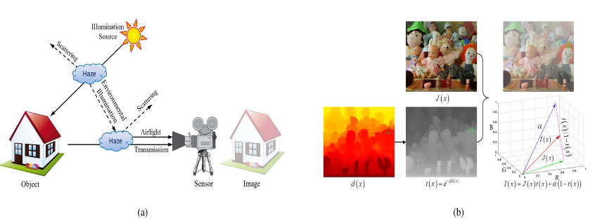
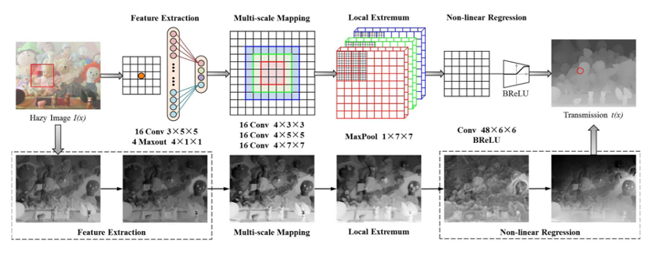
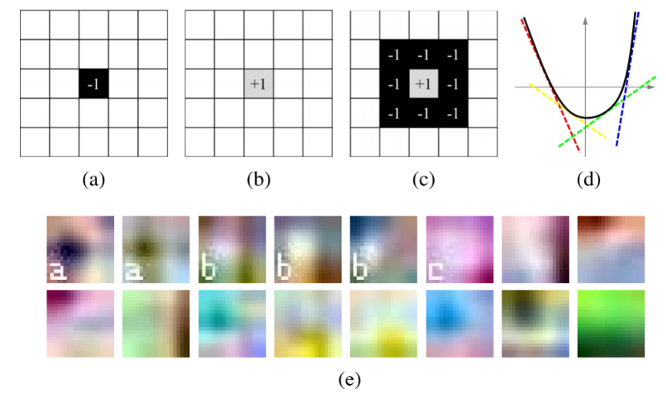

# CSCI-6221

gwu-csci6221-software_paradiams-summer_2020

***Single image haze removal is a challenging ill-posed problem. Existing methods use various constraints/priors to get plausible dehazing solutions. The key to achieve haze removal is to estimate a medium transmission map for an input hazy image.***

***DehazeNet, for medium transmission estimation. DehazeNet takes a hazy image as input, and outputs its medium transmission map that is subsequently used to recover a haze-free image via atmospheric scattering model. DehazeNet adopts convolu- tional neural network-based deep architecture, whose layers are specially designed to embody the established assumptions/priors in image dehazing. Specifically, the layers of Maxout units are used for feature extraction, which can generate almost all haze- relevant features.***

## I. INTRODUCTION

HAZE is a traditional atmospheric phenomenon where dust, smoke and other dry particles obscure the clarity of the atmosphere. Haze causes issues in the area of terrestrial photography, where the light penetration of dense atmosphere may be necessary to image distant subjects. This results in the visual effect of a loss of contrast in the subject, due to the effect of light scattering through the haze particles.For these reasons, haze removal is desired in both consumer photography and computer vision applications.

Haze removal is a challenging problem because the haze transmission depends on the unknown depth which varies at different positions. Various techniques of image enhancement have been applied to the problem of removing haze from a sin- gle image, including histogram-based [1], contrast-based [2] and saturation-based [3]. In addition, methods using multiple images or depth information have also been proposed. 

Single image haze removal has made significant progresses recently, due to the use of better assumptions and priors.

Inspired by dark-object subtraction technique, Dark Channel Prior (DCP) [8] is discovered based on empirical statistics of experiments on haze-free images, which shows at least one color channel has some pixels with very low intensities in most of non-haze patches. With dark channel prior, the thickness of haze is estimated and removed by the atmospheric scattering model. However, DCP loses dehazing quality in the sky images and is computa- tionally intensive. 

In recent years, haze-relevant priors are investigated in machine learning framework. Tang *et al.* [16] combine four types of haze- relevant features with Random Forests to estimate the trans- mission. Zhu *et al.* [17] create a linear model for estimating the scene depth of the hazy image under color attenuation prior and learns the parameters of the model with a supervised method. Despite the remarkable progress, these state-of-the- art methods are limited by the very same haze-relevant priors or heuristic cues - they are often less effective for some images.

Haze removal from a single image is a difficult vision task. In contrast, the human brain can quickly identify the hazy area from the natural scenery without any additional information. One might be tempted to propose biologically inspired models for image dehazing, by following the success of bio-inspired CNNs for high-level vision tasks such as image classification [18], face recognition [19] and object detection [20]. In fact, there have been a few (convolutional) neural network based deep learning methods that are recently proposed for low-level vision tasks of image restoration/ reconstruction [21]–[23]. However, these methods cannot be directly applied to single image haze removal.

Note that apart from estimation of a global atmospheric light magnitude, the key to achieve haze removal is to recover an accurate medium transmission map. To this end, we propose DehazeNet, a trainable CNN based end-to-end system for medium transmission estimation. DehazeNet takes a hazy image as input, and outputs its medium transmission map that is subsequently used to recover the haze-free image by a simple pixel-wise operation. Design of DehazeNet borrows ideas from established assumptions/principles in image dehaz- ing, while parameters of all its layers can be automatically learned from training hazy images. Experiments on benchmark images show that DehazeNet gives superior performance over existing methods, yet keeps efficient and easy to use. 

DehazeNet is an end-to-end system. It directly learns and estimates the mapping relations between hazy image patches and their medium transmissions. This is achieved by special design of its deep architecture to embody established image dehazing principles.

## II. RELATED WORKS

Many image dehazing methods have been proposed in the literature. In this section, we briefly review some important ones, paying attention to those proposing the atmospheric scattering model, which is the basic underlying model of image dehazing, and those proposing useful assumptions for computing haze-relevant features.

Imaging in hazy weather and atmospheric scattering model. (a) The process of imaging in hazy weather. The transmission attenuation *J* (*x*)*t* (*x*) caused by the reduction in reflected energy, leads to low brightness intensity. The airlight α (1 − *t* (*x*)) formed by the scattering of the environmental illumination, enhances the brightness and reduces the saturation. (b) Atmospheric scattering model. The observed hazy image *I* (*x*) is generated by the real scene *J* (*x*), the medium transmission *t* (*x*) and the global atmospheric light α. 

####  *A. Atmospheric Scattering Model*

To describe the formation of a hazy image, the atmospheric scattering model is first proposed by McCartney [25], which is further developed by Narasimhan and Nayar [2], [26]. The atmospheric scattering model can be formally written as

***I*(*x*)= *J*(*x*)*t*(*x*)+α(1−*t*(*x*)), (1)**

where *I* (*x*) is the observed hazy image, *J* (*x*) is the real scene to be recovered, *t* (*x*) is the medium transmission, α is the global atmospheric light, and *x* indexes pixels in the observed hazy image *I*. Fig. 1 gives an illustration. There are three unknowns in equation (1), and the real scene *J* (*x*) can be recovered after α and *t* (*x*) are estimated.

The medium transmission map *t*(*x*) describes the light portion that is not scattered and reaches the camera. *t* (*x*) is

defined as

***t* (*x*) = *e*−β*d*(*x*),**

where *d* (*x* ) is the
 camera, and β is the scattering coefficient of the atmosphere. Equation (2) suggests that when *d* (*x*) goes to infinity, *t* (*x*) approaches zero. Together with equation (1) we have

**α = *I* (*x*),*d* (*x*) → inf (3)**

In practical imaging of a distance view, *d*(*x*) cannot be infinity, but rather be a long distance that gives a very low transmission *t*0. Instead of relying on equation (3) to get the global atmospheric light α, it is more stably estimated based on the following rule

distance from the

**α = max *I* (*y*) ， (4)   *y*∈{*x*|*t*(*x*)≤*t*0}**

The discussion above suggests that *to recover a clean scene (i.e., to achieve haze removal), it is the key to estimate an accurate medium transmission map.*

#### *B. Dark Channel:* 

The dark channel prior is based on the wide observation on outdoor haze-free images. In most of the haze-free patches, at least one color channel has some pixels whose intensity values are very low and even close to zero. The dark channel [8] is defined as the minimum of all pixel colors in a local patch:

***D*(*x*)= min min *Ic*(*y*) , (5) *y*∈􏰀*r*(*x*) *c*∈{*r*,*g*,*b*}**

where *Ic* is a RGB color channel of *I* and 􏰀*r* (*x*) is a local patch centered at *x* with the size of *r* × *r*. The dark channel feature has a high correlation to the amount of haze in the image, and is used to estimate the medium transmission *t* (*x*) ∝ 1 − *D* (*x*) directly.

## III. THE PROPOSED DEHAZENET

***A. Layer Designs of DehazeNet***

The proposed DehazeNet consists of cascaded convolutional and pooling layers, with appropriate nonlinear activation func- tions employed after some of these layers. Fig. 2 shows the architecture of DehazeNet. Layers and nonlinear activations of DehazeNet are designed to implement four sequential operations for medium transmission estimation, namely, fea- ture extraction, multi-scale mapping, local extremum, and nonlinear regression. We detail these designs as follows.

*The architecture of DehazeNet. DehazeNet conceptually consists of four sequential operations (feature extraction, multi-scale mapping, local extremum and non-linear regression), which is constructed by 3 convolution layers, a max-pooling, a Maxout unit and a BReLU activation function.*

*1) Feature Extraction:* To address the ill-posed nature of image dehazing problem, existing methods propose various assumptions and based on these assumptions, they are able to extract haze-relevant features (e.g., dark channel, hue dis- parity, and color attenuation) densely over the image domain. Note that densely extracting these haze-relevant features is equivalent to convolving an input hazy image with appropriate filters,followedbynonlinearmappings.Inspiredbyextremum processing in color channels of those haze-relevant features, an unusual activation function called Maxout unit [28] is selected as the non-linear mapping for dimension reduction. Maxout unit is a simple feed-forward nonlinear activation function used in multi-layer perceptron or CNNs. When used in CNNs, it generates a new feature map by taking a pixel-wise maximization operation over *k* affine feature maps. 

*2) Multi-Scale Mapping:* In [16], multi-scale features have been proven effective for haze removal, which densely com- pute features of an input image at multiple spatial scales. Multi-scale feature extraction is also effective to achieve scale invariance. For example, the inception architecture in GoogLeNet [29] uses parallel convolutions with varying fil- ter sizes, and better addresses the issue of aligning objects in input images, resulting in state-of-the-art performance in ILSVRC14 [30]. 

*3) Local Extremum:* To achieve spatial invariance, the cor- tical complex cells in the visual cortex receive responses from the simple cells for linear feature integration. Lampl *et al.* [31] proposed that spatial integration properties of complex cells can be described by a series of pooling operations. According to the classical architecture of CNNs [32], the neighborhood maximum is considered under each pixel to overcome local sensitivity. In addition, the local extremum is in accordance with the assumption that the medium transmission is locally constant, and it is commonly to overcome the noise of transmission estimation. Therefore, we use a local extremum operation in the third layer of DehazeNet.

*4) Non-Linear Regression:* Standard choices of nonlinear

activation functions in deep networks include Sigmoid [33] and Rectified Linear Unit (ReLU). The former one is eas- ier to suffer from vanishing gradient, which may lead to slow convergence or poor local optima in networks training.

***B. Connections With Traditional Dehazing Methods***

         

*Filter weight and Maxout unit in the first layer operation F1. (a) Opposite filter. (b) All-pass filter. (c) Round filter. (d) Maxout. (e) The actual kernels learned from DehazeNet.*

The first layer feature *F*1 in DehazeNet is designed for haze-relevant feature extraction. Take dark channel feature [8] as an example. If the weight *W*1 is an opposite filter (sparse matrices with the value of −1 at the center of one channel, as in Fig. 4) and *B*1 is a unit bias, then the maximum output of the feature map is equivalent to the minimum of color channels, which is similar to dark channel [8] (see Equation (5)). In the same way, when the weight is a round filter as Fig. 4, *F*1 is similar to the maximum contrast [6] (see Equation (6)); when W1 includes all-pass filters and opposite filters, *F*1 is similar to the maximum and minimum feature maps, which are atomic operations of the color space transformation from RGB to HSV, then the color attenuation [17] (see Equation (7)) and hue disparity [27] (see Equation (8)) features are extracted. In conclusion, upon success of filter learning shown in Fig. 4, the haze-relevant features mentioned in Sec. II-B can be potentially extracted from the first layer of DehazeNet. On the other hand, Maxout activation functions can be considered as piece-wise linear approximations to arbitrary convex functions. In this paper, we choose the maximum across four feature maps (*k* = 4) to approximate an arbitrary convex function, as shown in Fig. 4.

White-colored objects in an image are similar to heavy haze scenes that are usually with high values of brightness and low values of saturation. Therefore, almost all the haze estimation models tend to consider the white-colored scene objects as being distant, resulting in inaccurate estimation of the medium transmission. Based on the assumption that the scene depth is locally constant, local extremum filter is commonly to overcome this problem [6], [8], [17]. In DehazeNet, local maximum filters of the third layer operation remove the local estimation error. Thus the direct attenuation term *J* (*x*)*t* (*x*) can be very close to zero when the transmission *t* (*x*) is close to zero. The directly recovered scene radiance *J* (*x*) is prone to noise. In DehazeNet, we propose BReLU to restrict the values of transmission between *t*min and *t*max, thus alleviating the noise problem. Note that BReLU is equivalent to the boundary constraints used in traditional methods [8], [17].

***C. Training of DehazeNet***

*1) Training Data:* It is in general costly to collect a vast amount of labelled data for training deep models [18]. For training of DehazeNet, it is even more difficult as the pairs of hazy and haze-free images of natural scenes (or the pairs of hazy images and their associated medium transmission maps) are not massively available. Instead, we resort to synthesized training data based on the physical haze formation model [16].

More specifically, we synthesize training pairs of hazy and haze-free image patches based on two assumptions [16]: first, image content is independent of medium transmission (the same image content can appear at any depths of scenes);second, medium transmission is locally constant (image pixels

in a small patch tend to have similar depths). These assumptions suggest that we can assume an arbitrary transmission for an individual image patch. Given a haze-free patch *J* *P* (*x* ),the atmospheric light α, and a random transmission *t* ∈ (0, 1), *PP*

a hazy patch is synthesized as *I* (*x*)= *J* (*x*)*t* +α(1−*t*). To reduce the uncertainty in variable learning, atmospheric light α is set to 1.

In this work, we collect haze-free images from the Internet, and randomly sample from them patches of size 16 × 16. Different from [16], these haze-free images include not only those capturing people’s daily life, but also those of natural and city landscapes, since we believe that this variety of training samples can be learned into the filters of DehazeNet. 

## Conclusion

The sky region in a hazy image is a challenge of dehazing, because clouds and haze are similar natural phenomenons with the same atmospheric scattering model. As shown in the first three figures, most of the haze is removed in the (b-d) results, and the details of the scenes and objects are well restored. However, the results significantly suffer from over-enhancement in the sky region. Overall, the sky region of these images is much darker than it should be or is oversaturated and distorted. Haze generally exists only in the atmospheric surface layer, and thus the sky region almost does not require handling. Based on the learning framework, CAP and RF avoid color distortion in the sky, but non-sky regions are enhanced poorly because of the non-content regression model (for example, the rock-soil of the first image and the green flatlands in the third image). DehazeNet appears to be capable of finding the sky region to keep the color, and assures a good dehazing effect in other regions. 

**The reason is that the patch attribute can be learned in the hidden layer of DehazeNet, and it contributes to the dehazing effects in the sky.**

# RESIDE

### A Benchmark for Single Image Dehazing

## Abstract

We present a comprehensive study and evaluation of existing single image dehazing algorithms, using a new large-scale benchmark consisting of both synthetic and real-world hazy images, called **REalistic Single Image DEhazing (RESIDE)**. RESIDE highlights diverse data sources and image contents, and is divided into five subsets, each serving different training or evaluation purposes. We further provide a rich variety of criteria for dehazing algorithm evaluation, ranging from full-reference metrics, to no-reference metrics, to subjective evaluation and the novel task-driven evaluation. Experiments on RESIDE shed light on the comparisons and limitations of state-of-the-art dehazing algorithms, and suggest promising future directions. 

## Overview

